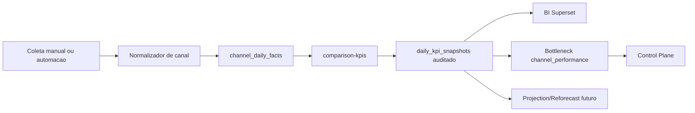

# DGE 2.0 - Channel Intelligence Backbone

Fonte original DGE 2.0: `docs/architecture/dge-2.0-channel-intelligence-backbone.md`.

---

# DGE 2.0 - Channel Intelligence Backbone

## Objetivo

O Channel Intelligence Backbone cria a comparacao oficial entre canal proprio, Shopee e Mercado Livre sem transformar marketplaces em dominios operacionais da DGE.

A regra de borda e:

- Canal proprio: pode gerar inteligencia operacional, gargalos, acoes internas, BI e suporte a reforecast.
- Shopee e Mercado Livre: entram como referencia comparativa e projetiva contra canal proprio.
- Marketplace agregado: permanece apenas como visao derivada, nao como fonte primaria quando os canais separados existem.

## Dados canonicos

`sales_channels` e a dimensao canonica de canais. Os canais oficiais v1 sao:

- `own_channel`
- `shopee`
- `mercado_livre`

`channel_daily_facts` e o fato diario por canal. Ele pode nascer por coleta manual e depois receber automacao via ecommerce, ERP, marketplace reports ou n8n.

## Fluxo



## KPIs derivados

O modulo calcula:

- GMV liquido por canal.
- Pedidos e ticket medio.
- Custo total do canal.
- Take rate.
- Margem de contribuicao.
- Peso do frete.
- Subsidio de frete.
- Cancelamento e retorno.
- Cobertura de dados de cliente.
- Vazamento de marketplace.
- Deltas entre canal proprio e marketplaces agregados.

## Projecoes

Nesta fase, o modulo nao muda projection engine nem baseline oficial. Ele prepara os dados para:

- projeções por canal;
- visao mesclada canal proprio vs marketplaces;
- reforecast preview quando a diferenca for material e persistente;
- Superset como camada de BI para leitura executiva e exploracao analitica.

O endpoint `GET /api/projections/channel-readiness` e a ponte v1 entre fatos por canal e projecao. Ele retorna:

- status de prontidao da janela analisada;
- cobertura temporal;
- canais ausentes;
- inputs comparativos do canal proprio e marketplaces;
- formulas canalizadas impactadas;
- familias de projecao afetadas;
- garantias de que a leitura e preview-only.

Essa leitura nao recalcula o baseline, nao cria reforecast oficial e nao da inteligencia operacional aos marketplaces.

## Channel Projection Preview v1

`GET /api/projections/channel-preview` usa a readiness como pre-condicao e gera um preview mensal por canal.

Garantias v1:

- nao recalcula projection core;
- nao altera baseline oficial;
- nao cria `projection_version`;
- nao cria `reforecast_proposal`;
- persiste apenas `channel_projection_previews` como trace auditavel;
- usa `observed_flat` como unico growth mode ativo;
- mantem Shopee e Mercado Livre como benchmark comparativo/projetivo.

Growth modes futuros como `ramp_recalibrated`, `manual_growth_curve` e `ai_suggested_curve` ficam apenas no roadmap ate existir contrato de reforecast maduro.

## Channel Projection Variance v1

`GET /api/projections/channel-variances` compara um `channel_projection_preview` persistido contra fatos observados em `channel_daily_facts`.

O resultado e persistido em `channel_projection_variances` como evidencia, nao como reforecast.

Garantias v1:

- nao cria reforecast automaticamente;
- nao cria projection version;
- nao muda projection version oficial;
- classifica variancias como `normal`, `watch`, `material` ou `reforecast_candidate`;
- marketplaces continuam apenas comparativos/projetivos;
- qualquer reforecast futuro precisa de fluxo governado e aprovacao humana.

## Channel Reforecast Candidate v1

`GET /api/projections/channel-reforecast-candidates` transforma variancias `material` ou `reforecast_candidate` em candidatos governados.

`POST /api/projections/channel-reforecast-candidates/:id/approve-for-case` registra apenas a intencao de promover o candidato para um case futuro.

`POST /api/projections/channel-reforecast-candidates/:id/create-case` cria um `reforecast_case` governado somente quando o candidato ja esta em `approved_for_case_intent`.

O case usa a projection version oficial ativa mais recente como baseline e registra evidencia do candidato, da variancia e do preview de canal. Ele abre o fluxo oficial de analise, mas ainda nao gera preview, proposal ou projection version automaticamente.

## Channel Reforecast Preview Integration v1

Cases com `trigger_type = channel_projection_variance` podem usar o endpoint oficial `POST /api/projections/reforecast-cases/:id/preview`.

O preview oficial passa a reconhecer `channel_projection_variance` como familia de evidencia nativa. Na v1, o runtime canalizado e completo dentro do `projectionCore` quando existe evidencia auditada:

- `ownChannelGMV` vira override ativo a partir do GMV observado/projetado do canal proprio;
- `marketplaceGMV` vira override ativo a partir do agregado Shopee + Mercado Livre;
- take rate proprio/marketplace, margem, peso do frete, cobertura de dados e leakage entram como overrides ativos;
- `projectionStates[].outputs.channelRuntime` explicita fonte, confidence, metricas mensais e fronteira de marketplace;
- `projectionStates[].outputs.channelFinancialImpact` mostra a politica economica aplicada ao lucro mensal;
- `projectionStates[].outputs.ownVsMarketplaceDeltas` expõe os deltas comparativos usados pelo BI e pelo preview.

Essa integracao nao cria versao oficial, nao cria acao operacional para marketplace e nao transforma Shopee/Mercado Livre em dominios operacionais inteligentes.

## Channel Runtime Consolidation A1

O runtime canalizado e formalizado como `projection.channelRuntime.v1`.

Consolidacoes ativas:

- o `projectionCore` usa contrato dedicado para montar `channelRuntime`, `channelFinancialImpact` e `ownVsMarketplaceDeltas`;
- `bi_projection_channel_runtime_dataset` expõe a leitura mensal para Superset, Projection Explorer, Channel Intelligence, Reforecast Control e AI/RAI Observability;
- `POST /api/kpis/bottlenecks/channels/run` continua lendo facts auditados, mas tambem passa a ler evidencia de runtime canalizado;
- sinais de runtime carregam `metadata.runtimeEvidence`;
- nenhuma tabela nova e criada, pois a fonte persistida v1 e `projection_states.outputs_json`.

Sinais de gargalo do runtime v1:

- `channel_runtime_margin_pressure`;
- `channel_runtime_freight_profit_pressure`;
- `channel_runtime_marketplace_leakage_pressure`;
- `channel_runtime_customer_data_gap`;
- `channel_runtime_low_confidence`;
- `channel_runtime_variance_requires_reforecast_review`.

Garantias v1:

- listagem e aprovacao de candidato nao criam `reforecast_case`;
- criacao de case nao cria `reforecast_proposal`;
- criacao de case nao cria `projection_version`;
- nao altera a projecao oficial;
- aprovar candidato registra decisao e timeline, mas nao executa o reforecast;
- criar case apenas abre a etapa governada anterior ao reforecast preview oficial;
- marketplaces continuam apenas como evidencia comparativa/projetiva.

## Official Channel Reforecast v1

Cases de canal podem virar versao oficial somente pelo fluxo governado existente:

```txt
channel variance
-> candidate
-> case
-> preview
-> review
-> formal proposal
-> official approval
-> official reforecast version filha
```

Nao existe motor paralelo para reforecast de canal. O endpoint oficial continua sendo o mesmo fluxo de reforecast:

- `POST /api/projections/reforecast-cases/:id/preview`;
- `POST /api/projections/reforecast-previews/:id/review`;
- `POST /api/projections/reforecast-previews/:id/approve-for-proposal`;
- `POST /api/projections/reforecast-previews/:id/create-formal-proposal`;
- `POST /api/projections/reforecast-proposals/:id/approve-official`;
- `POST /api/projections/reforecast-proposals/:id/create-official-version`.

A official version registra:

- `reforecastFamily: channel_runtime`;
- `channelRuntimeContractVersion: projection.channelRuntime.v1`;
- `channelRuntimeApplied`;
- `channelRuntimeOverrideKeys`;
- `marketplaceBoundary: comparative_projection_only`;
- `ownChannelBoundary: operational_intelligence_allowed`.

Guardrails obrigatorios:

- preview precisa conter `channelRuntime`;
- evidencia precisa conter `channel_projection_variance`;
- overrides precisam conter `ownChannelGMV` e `marketplaceGMV`;
- marketplaces precisam declarar `marketplaceOperationalIntelligence: false`;
- somente `owner` ou `admin` podem aprovar officializacao;
- acknowledgements oficiais precisam estar completos.

O official reforecast canalizado usa assumption overrides ativos. Ele nao depende de formula swap para oficializar a versao v1.

Ao criar a versao oficial, a DGE preserva:

- baseline original;
- parent-child lineage;
- diff vs parent;
- active reference;
- leitura BI via `bi_projection_channel_runtime_dataset`;
- fronteira marketplace apenas comparativa/projetiva.

## Governanca

Fatos manuais por canal devem seguir a mesma logica de auditoria da coleta manual:

- coleta persistente diaria;
- aprovacao por superior quando aplicavel;
- publicacao derivada em `daily_kpi_snapshots`;
- rastreio por `timeline_events`.

Automacoes futuras substituem a digitacao manual, mas nao removem auditoria diaria.
