# DGE 2.0 - Freight & Fulfillment Operational Contract Blueprint v1

Fonte original DGE 2.0: `docs/architecture/dge-2.0-freight-fulfillment-operational-contract-blueprint.md`.

---

# DGE 2.0 - Freight & Fulfillment Operational Contract Blueprint v1

## Decisao

Frete, fulfillment, hubs, retirada em loja, Loggi, Frenet, Bling e ecommerce devem formar uma espinha operacional propria dentro da DGE 2.0.

Esta camada nao deve nascer como apenas calculo de frete. Ela deve nascer como contrato operacional rastreavel: o pedido entra, o estoque e consultado por hub, o caminho logistico e decidido, o frete e cotado/emitido, a etiqueta e acompanhada, eventos logisticos sao registrados, gargalos sao detectados e o impacto pode alimentar BI, reforecast e futuramente formula swap.

## Fronteiras De Responsabilidade

### Ecommerce

Responsavel por:

- checkout;
- carrinho;
- cliente;
- comportamento de navegacao;
- selecao de frete apresentada ao cliente;
- pagamento;
- pedido transacional;
- promessa comercial de entrega;
- eventos de produto/usuario/app;
- cupom, campanha e origem de conversao.

Nao deve ser responsabilidade primaria do ecommerce:

- decidir sozinho leitura executiva de gargalo;
- recalcular projecao DGE;
- reescrever forecast;
- consolidar auditoria operacional multi-sistema.

### ERP / Bling

Responsavel por:

- estoque oficial por SKU/unidade;
- venda fiscal;
- nota fiscal;
- cadastro fiscal de produto;
- saldo oficial;
- atualizacao operacional de pedido quando aplicavel;
- fonte de verdade fiscal/ERP.

Nao deve ser responsabilidade primaria do ERP:

- explicar impacto projetado;
- decidir reforecast;
- orquestrar recomendacao executiva;
- substituir cockpit DGE.

### Frenet / Loggi / Transportadoras

Responsaveis por:

- cotacao;
- servico de entrega;
- custo/logistica de envio;
- geracao/retorno de etiqueta quando aplicavel;
- tracking;
- eventos externos de transporte;
- logistica reversa quando aplicavel.

Nao devem ser responsabilidade primaria desses provedores:

- consolidar margem;
- avaliar estoque descentralizado;
- explicar impacto financeiro do frete na projecao;
- governar reforecast.

### DGE

Responsavel por:

- normalizar dados recebidos;
- preservar origem e confianca;
- auditar fluxo operacional;
- comparar esperado vs realizado;
- detectar gargalos;
- calcular KPIs operacionais;
- gerar snapshots diarios/mensais;
- alimentar BI/Superset;
- preparar reforecast e formula swap quando elegivel;
- expor leitura executiva e operacional;
- registrar traces e decisoes.

Nao deve ser responsabilidade primaria da DGE nesta fase:

- operar checkout em tempo real;
- reservar estoque no carrinho;
- emitir NF diretamente;
- substituir Frenet/Loggi como provedor de etiqueta;
- prometer prazo diretamente ao cliente.

## Entidades Canonicas

### Pedido

Fonte principal: ecommerce ou ERP/Bling.

Tabela atual relacionada:

- `commerce_orders`;
- `commerce_order_items`;
- `commerce_order_payments`;
- `commerce_operational_events`.

Campos/estados essenciais:

- `order_created`;
- `payment_pending`;
- `payment_approved`;
- `payment_failed`;
- `invoice_pending`;
- `invoice_issued`;
- `cancelled`;
- `ready_for_fulfillment`;
- `fulfillment_blocked`.

### Estoque / Hub

Fonte principal: Bling/ERP, com entrada manual contingencial.

Tabelas atuais relacionadas:

- `operational_nodes`;
- `products`;
- `inventory_availability_snapshots`;
- `inventory_availability_items`.

Estados de leitura:

- `single_hub_available`;
- `multi_hub_available`;
- `partial_stock_available`;
- `stockout`;
- `low_stock`;
- `manual_review_required`;
- `stale_inventory_snapshot`.

### Fulfillment

Fonte principal: DGE como control tower.

Tabelas atuais relacionadas:

- `fulfillment_analyses`;
- `fulfillment_options`;
- `fulfillment_option_items`.

Estados canonicos:

- `single_hub_fulfillable`;
- `decentralized_order_stock`;
- `internal_transfer_recommended`;
- `split_shipping_required`;
- `store_pickup_available`;
- `manual_review_required`;
- `partial_stock_available`;
- `unfulfillable`.

Decisoes esperadas:

- enviar por hub unico;
- enviar split por multiplos hubs;
- transferir internamente para consolidar envio;
- retirar em loja;
- bloquear para revisao manual;
- acionar compra/reposicao futura.

### Frete Economico

Fonte principal: ecommerce, Frenet/Loggi, ERP, entrada manual contingencial.

Tabela atual relacionada:

- `freight_economic_facts`.

Metricas obrigatorias:

- frete cotado;
- frete cobrado do cliente;
- frete pago ao carrier;
- subsidio de frete;
- delta cotado vs pago;
- frete pago como % do pedido liquido;
- frete cobrado como % do pedido liquido;
- frete pago como % do GMV global;
- frete subsidiado por periodo;
- pedidos com frete gratis.

### Shipment / Etiqueta / Reversa

Fonte principal: Frenet/Loggi/transportadora, com entrada manual contingencial.

Tabelas atuais relacionadas:

- `logistics_shipments`;
- `logistics_shipment_events`;
- `logistics_labels`;
- `logistics_returns`.

Estados canonicos:

- `order_created`;
- `invoice_issued`;
- `label_requested`;
- `label_issued`;
- `picking_started`;
- `picked`;
- `packed`;
- `posted`;
- `in_transit`;
- `delivered`;
- `delivery_failed`;
- `cancelled`;
- `return_requested`;
- `reverse_logistics_requested`;
- `returned`.

### Pos-Entrega / Garantia / Troca / Ocorrencias

Fonte principal: ecommerce, atendimento, ERP/Bling, transportadora e entrada manual contingencial.

Tabelas atuais relacionadas:

- `logistics_returns`;
- `logistics_shipment_events`;
- futura tabela dedicada `commerce_after_sales_cases` ou `logistics_exception_cases`.

Estados canonicos:

- `warranty_requested`;
- `warranty_approved`;
- `warranty_rejected`;
- `exchange_requested`;
- `exchange_approved`;
- `exchange_shipped`;
- `damage_reported`;
- `shipping_damage_reported`;
- `product_damage_reported`;
- `lost_package_reported`;
- `not_received_claimed`;
- `carrier_investigation_opened`;
- `carrier_investigation_resolved`;
- `refund_requested`;
- `refund_approved`;
- `replacement_requested`;
- `replacement_shipped`;
- `customer_claim_closed`.

Tipos de ocorrencia:

- garantia;
- troca;
- avaria no transporte;
- dano no produto;
- produto incorreto;
- item faltante;
- pedido nao recebido;
- extravio;
- entrega contestada;
- devolucao por arrependimento;
- devolucao por defeito;
- logistica reversa;
- reembolso;
- reposicao.

Impactos esperados:

- custo de reversa;
- custo de reenvio;
- custo de reposicao;
- perda de margem;
- tempo de atendimento;
- risco de chargeback/reembolso;
- risco de churn;
- impacto em reputacao;
- variancia de lucro/margem;
- gargalo de transportadora;
- gargalo de qualidade/estoque/produto.

## Fluxo Operacional Canonico

```mermaid
flowchart LR
  A["Pedido criado no ecommerce"] --> B["Pagamento aprovado"]
  B --> C["Pedido normalizado na DGE"]
  C --> D["Consulta estoque por hub"]
  D --> E{"Hub unico atende?"}
  E -->|Sim| F["Fulfillment single hub"]
  E -->|Nao| G{"Itens em multiplos hubs?"}
  G -->|Sim| H["Estoque descentralizado do pedido"]
  H --> I{"Transferencia interna compensa?"}
  I -->|Sim| J["Transferencia interna + envio unico"]
  I -->|Nao| K["Split shipping / multiplas etiquetas"]
  G -->|Nao| L["Revisao manual / ruptura"]
  F --> M["Cotacao Frenet/Loggi"]
  J --> M
  K --> M
  M --> N["Etiqueta emitida"]
  N --> O["Separado / postado / entregue"]
  O --> P{"Ocorrencia pos-entrega?"}
  P -->|Nao| Q["KPIs + BI + gargalos"]
  P -->|Sim| R["Garantia / troca / avaria / dano / nao recebimento"]
  R --> S["Reversa / reenvio / reembolso / investigacao carrier"]
  S --> Q
  Q --> T["Reforecast / Formula readiness futura"]
```

## Regras De Decisao Inicial

### Hub Unico

Prioridade mais alta quando:

- todos os SKUs do pedido existem no mesmo hub;
- quantidade disponivel atende a quantidade requerida;
- snapshot de estoque esta fresco;
- custo/tempo de envio nao viola limite configurado.

Resultado:

- `fulfillment_state = single_hub_fulfillable`;
- `estimated_shipments_count = 1`;
- menor risco operacional.

### Estoque Descentralizado

Ocorre quando:

- nenhum hub unico atende todos os itens;
- os itens existem em hubs diferentes;
- o pedido ainda e atendivel sem ruptura total.

Resultado:

- `fulfillment_state = decentralized_order_stock`;
- risco de multiplas etiquetas;
- risco de frete duplicado;
- possivel gargalo de margem;
- candidato a transferencia interna.

### Transferencia Interna

Recomendada quando:

- estoque existe em mais de um hub;
- consolidar itens reduz numero de etiquetas;
- prazo interno e custo interno tendem a ser menores que split externo;
- pedido ainda nao foi prometido/postado.

Resultado:

- `fulfillment_state = internal_transfer_recommended`;
- `estimated_internal_transfers_count > 0`;
- `estimated_shipments_count = 1`.

### Split Shipping

Aceito quando:

- transferencia interna nao compensa;
- prazo prometido exige despacho imediato;
- hubs diferentes precisam postar diretamente;
- custo de multiplas etiquetas e aceitavel ou inevitavel.

Resultado:

- `fulfillment_state = split_shipping_required`;
- `estimated_shipments_count > 1`;
- gargalo potencial de frete.

### Retirada Em Loja

Deve ser tratada como fulfillment method proprio, nao como frete comum.

Resultado:

- `delivery_method = store_pickup`;
- frete pago a carrier deve ser zero;
- pode ter custo operacional interno;
- deve impactar `pickupInStorePercent` e frete medio efetivo.

### Loggi

Deve entrar como provider logistico e/ou carrier, sem misturar com a DGE.

Resultado:

- `provider = loggi`;
- eventos entram em `logistics_shipments`, `logistics_labels`, `logistics_shipment_events`;
- custos entram em `freight_economic_facts`.

## KPIs Operacionais Necessarios

### Frete

- `freight_paid_percent_of_order_net`;
- `freight_charged_percent_of_order_net`;
- `freight_paid_percent_of_global_gmv`;
- `freight_total_subsidy_amount`;
- `freight_total_quote_vs_paid_delta`;
- `freight_free_shipping_order_count`;
- `average_freight_cost`;
- `actual_freight_cost`;
- `split_shipping_freight_burden`;
- `store_pickup_savings_estimate`.

### Fulfillment

- `fulfillment_analysis_count`;
- `fulfillment_single_hub_fulfillable_count`;
- `fulfillment_decentralized_order_stock_count`;
- `fulfillment_internal_transfer_recommended_count`;
- `fulfillment_split_shipping_option_count`;
- `fulfillment_manual_review_required_count`;
- `fulfillment_unfulfillable_count`;
- `fulfillment_decentralized_order_stock_rate_percent`;
- `fulfillment_internal_transfer_rate_percent`.

### Logistica

- `logistics_shipment_count`;
- `logistics_awaiting_label_count`;
- `logistics_label_issued_count`;
- `logistics_posted_count`;
- `logistics_delivered_count`;
- `logistics_delivery_failed_count`;
- `logistics_return_flow_count`;
- `average_delivery_days`;
- `label_latency_hours`;
- `picking_latency_hours`;
- `posting_latency_hours`.

### Pos-Entrega / Garantia / Ocorrencias

- `after_sales_case_count`;
- `warranty_request_count`;
- `exchange_request_count`;
- `damage_report_count`;
- `not_received_claim_count`;
- `lost_package_claim_count`;
- `reverse_logistics_cost_amount`;
- `replacement_shipping_cost_amount`;
- `refund_amount`;
- `after_sales_cost_percent_of_order_net`;
- `claim_rate_percent`;
- `damage_rate_percent`;
- `not_received_rate_percent`;
- `warranty_approval_rate_percent`;
- `average_case_resolution_hours`;
- `carrier_claim_resolution_hours`;

## Gargalos Que Devem Nascer Desse Contrato

### Frete

- frete pago acima do esperado;
- subsidio alto;
- frete como % do pedido acima do limite;
- delta cotado vs pago alto;
- excesso de frete gratis;
- split shipping pressionando margem;
- provider com custo anormal.

### Fulfillment

- estoque descentralizado recorrente;
- transferencia interna recorrente;
- ruptura por SKU;
- hub sem sortimento suficiente;
- excesso de revisao manual;
- pedidos nao atendiveis.

### Logistica

- etiqueta pendente;
- atraso entre nota e etiqueta;
- atraso entre etiqueta e postagem;
- falha de entrega;
- reversa acima do normal;
- provider com SLA abaixo.

### Pos-Entrega / Garantia / Ocorrencias

- garantia acima do esperado;
- troca acima do esperado;
- avaria recorrente por transportadora;
- dano recorrente por SKU/categoria;
- nao recebimento acima do esperado;
- extravio recorrente;
- custo de reversa pressionando margem;
- reembolso acima do limite;
- demora na resolucao de caso;
- aumento de casos por hub/origem;
- aumento de casos por transportadora;
- ruptura de reposicao para troca/garantia.

## Relacao Com Reforecast E Formula Swap

### Agora

Frete/logistica ainda devem alimentar:

- KPIs;
- snapshots diarios;
- trace mensal;
- variancias;
- bottleneck detection;
- BI;
- reforecast preview;
- evidence para suporte tecnico.

### Ainda Nao

Frete/logistica nao devem executar formula swap oficial automaticamente nesta fase.

Motivo:

- `logistics.effective_freight_cost` depende de pedido, etiqueta, split, retirada, provider e subsidio;
- `logistics.effective_delivery_days` depende de promessa, postagem, transportadora, hub e eventos reais;
- essas formulas precisam de contrato operacional maduro antes de virar runtime oficial.

### Futuro

Quando a maturidade subir, a capability matrix pode mudar:

- `logistics.effective_freight_cost`: `planned` -> `active`;
- `logistics.effective_delivery_days`: `planned` -> `active`.

Novas formulas futuras podem nascer para:

- custo efetivo de reversa;
- custo de garantia/troca;
- perda de margem por ocorrencia;
- taxa de avaria por transportadora;
- taxa de nao recebimento por provider/regiao;
- impacto pos-entrega no LTV/recompra.

Pre-condicoes:

- frete economico com cobertura suficiente;
- shipments com lifecycle completo;
- hubs e estoque confiaveis;
- etiqueta e provider rastreados;
- casos pos-entrega classificados;
- custos de reversa/reenvio/reembolso registrados;
- BI mostrando consistencia;
- bottlenecks diarios/semanais/mensais estaveis.

## BI E Cockpit

Datasets atuais relacionados:

- `bi_freight_economics_dataset`;
- `bi_fulfillment_options_dataset`;
- `bi_logistics_shipments_dataset`;
- `bi_logistics_events_dataset`;
- `bi_inventory_availability_dataset`;
- `bi_commerce_orders_dataset`;
- `bi_commerce_order_items_dataset`;
- `bi_bottleneck_signals_dataset`;
- `bi_observed_projection_variances_dataset`.

Datasets futuros recomendados:

- `bi_after_sales_cases_dataset`;
- `bi_warranty_claims_dataset`;
- `bi_exchange_flows_dataset`;
- `bi_shipping_damage_claims_dataset`;
- `bi_not_received_claims_dataset`;
- `bi_reverse_logistics_costs_dataset`;

Telas futuras do cockpit:

- Freight Control;
- Fulfillment Control Tower;
- Hub Stock Map;
- Shipment Timeline;
- Label Queue;
- Reverse Logistics Queue;
- Warranty & Exchange Queue;
- Damage & Claims Monitor;
- Not Received Claims Monitor;
- Freight Burden Monitor;
- Split Shipping Risk;
- Store Pickup Performance.

## Blueprint De Implementacao

### Lote A - Contrato Operacional

- registry de estados canonicos;
- matriz de responsabilidade por sistema;
- validacao de transicoes permitidas;
- doc e smoke unitario.

### Lote B - Event Timeline Unificada

- view/dataset que una commerce events, shipment events, labels, returns e fulfillment;
- leitura por pedido;
- leitura por shipment;
- leitura por hub.

### Lote C - Freight/Fulfillment KPIs Ampliados

- label latency;
- picking latency;
- posting latency;
- split shipping freight burden;
- store pickup savings;
- provider SLA.

### Lote D - Pos-Entrega E Ocorrencias

- contrato de cases pos-entrega;
- garantia;
- troca;
- avaria;
- dano;
- nao recebimento;
- extravio;
- reembolso;
- reenvio/reposicao;
- custo de reversa;
- KPIs e BI especificos.

### Lote E - Bottleneck Detection Ampliado

- daily/weekly/monthly para frete;
- daily/weekly/monthly para fulfillment;
- daily/weekly/monthly para logistics;
- daily/weekly/monthly para pos-entrega/ocorrencias;
- consolidacao executiva por severidade.

### Lote F - Formula Swap Readiness

- enriquecer capability matrix com criterios objetivos de ativacao;
- permitir preview mais rico para frete/logistica;
- somente depois avaliar runtime oficial.

## Guardrails

- DGE nao executa checkout runtime nesta fase;
- DGE nao reserva estoque no carrinho nesta fase;
- DGE nao emite NF diretamente;
- DGE nao substitui Frenet/Loggi;
- entrada manual continua contingencia;
- toda automacao futura precisa preservar auditoria;
- nenhum calculo de projection oficial deve ser alterado por evento logistico sem fluxo de reforecast governado.
